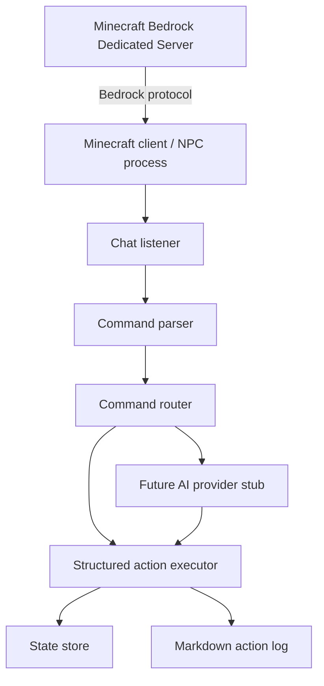

# Kuma Agent Architecture

This document is a compact reminder of how the bot is wired end to end.
It is meant to help future-you quickly recall the system shape without
re-reading every source file.

## Big Picture



The Mermaid view is the quickest mental model. The plain text view below is
kept as a fallback for terminals and plain-text readers.

```text
Minecraft Bedrock Dedicated Server
        │
        │ Bedrock protocol
        ▼
Minecraft client / NPC process
        │
        ├── Chat listener
        │
        ├── Command parser
        │
        ├── Command router
        │      ├── Deterministic local commands
        │      └── Future AI provider stub
        │
        ├── Structured action executor
        │
        ├── State store
        │
        └── Markdown action log
```

The design goal is to keep the runtime tiny:

- One Node.js process
- One Bedrock client connection
- Minimal persistent state
- No local LLM
- No heavy orchestration layer

## Core Responsibilities

### 1. Minecraft Client

File: [src/minecraft/client.js](/Users/daebum/Development/mark-ai-tomo/src/minecraft/client.js)

This is the network-facing part of the bot.

Input:

- Connection settings from `src/config.js`

Output:

- Live Bedrock client instance
- Lifecycle events
- Normalized chat callbacks

Responsibilities:

- Connect to the Bedrock Dedicated Server
- Log connection, join, spawn, error, and close events
- Reconnect with backoff when the connection drops
- Forward chat packets to the higher-level chat handler

Important detail:

- It ignores messages from the bot itself
- It only forwards messages that begin with the configured prefix

### 2. Chat Normalization

File: [src/minecraft/chat.js](/Users/daebum/Development/mark-ai-tomo/src/minecraft/chat.js)

This layer strips the bot prefix and turns raw packets into a small
normalized object.

Input:

- Raw Bedrock `text` packet
- Bot prefix

Output:

- `{ sourceName, input, rawMessage, packet }`

Example:

```text
Kuma hello
```

becomes:

```json
{
  "sourceName": "PlayerName",
  "input": "hello",
  "rawMessage": "Kuma hello"
}
```

### 3. Command Parser

File: [src/commands/parser.js](/Users/daebum/Development/mark-ai-tomo/src/commands/parser.js)

This is the deterministic command layer.

Input:

- Normalized text such as `hello`, `stop`, or `follow me`

Output:

- Structured action object

It converts normalized text into structured actions such as:

```json
{ "action": "say", "message": "안녕!" }
```

```json
{ "action": "stop" }
```

```json
{ "action": "follow", "target": "PlayerName" }
```

If nothing matches, it returns:

```json
{ "action": "unknown", "input": "original text" }
```

This file should stay simple and predictable.
Do not put LLM logic here.

### 4. Command Router

File: [src/commands/router.js](/Users/daebum/Development/mark-ai-tomo/src/commands/router.js)

The router decides what to do with a parsed command.

Input:

- Parsed action from the command parser
- Context from the chat listener

Output:

- Routed action result

Flow:

1. Try local deterministic parsing first
2. If still unknown, ask the AI provider stub
3. If still unknown, return `unknown`

This preserves a clean split between:

- Local rules that never call an API
- Future AI-backed decisions

### 5. Action Executor

Files:

- [src/actions/executor.js](/Users/daebum/Development/mark-ai-tomo/src/actions/executor.js)
- [src/actions/say.js](/Users/daebum/Development/mark-ai-tomo/src/actions/say.js)
- [src/actions/stop.js](/Users/daebum/Development/mark-ai-tomo/src/actions/stop.js)
- [src/actions/follow.js](/Users/daebum/Development/mark-ai-tomo/src/actions/follow.js)

The executor performs the structured action.

Input:

- Structured action object
- Runtime context

Output:

- Side effects such as chat messages
- Updated state for follow/stop actions

Current actions:

- `say`
- `stop`
- `follow`
- `unknown`

The executor is also where state updates happen.

### 6. State Store

File: [src/state/store.js](/Users/daebum/Development/mark-ai-tomo/src/state/store.js)

This is the lightweight JSON persistence layer.

Input:

- Small state patches

Output:

- Saved JSON state on disk
- In-memory copy of the latest state

It stores small bits of runtime memory such as:

- Last action
- Last update time
- Follow target

It is intentionally simple because the VPS has limited RAM.

### 7. Action Log

File: [src/state/action-log.js](/Users/daebum/Development/mark-ai-tomo/src/state/action-log.js)

The bot writes a human-readable Markdown log of what happened.

Input:

- Executed action details
- Raw chat message
- Parsed input

Output:

- Daily Markdown file with a table of activity

Current format:

- One file per day
- Path pattern: `data/logs/YYYY-MM-DD.md`
- Markdown table format
- Includes raw chat, parsed input, structured action, result, and note fields

This is meant for quick review after the fact.

## Runtime Flow

### Normal chat command

```text
Player says "Kuma hello"
        │
        ▼
Chat listener receives packet
        │
        ▼
Prefix stripped to "hello"
        │
        ▼
Command parser returns { action: "say", message: "Hello!" }
        │
        ▼
Action executor sends chat message from the bot
        │
        ▼
State store and Markdown log are updated
```

### Unknown input

```text
Player says "Kuma something strange"
        │
        ▼
Parser returns unknown
        │
        ▼
Router asks AI provider stub
        │
        ▼
Stub returns null
        │
        ▼
Action marked as unknown and logged
```

### Disconnect and reconnect

```text
Connection closes
        │
        ▼
Client logs the close event
        │
        ▼
Reconnect timer starts
        │
        ▼
Client reconnects after backoff
```

## Error Flow

### Connection error

```text
Client creation or connection fails
        │
        ▼
Error is logged
        │
        ▼
Reconnect timer is scheduled
        │
        ▼
Client tries again after the configured delay
```

### Unsupported server version

```text
Server protocol is newer than bedrock-protocol support
        │
        ▼
Login may succeed briefly or fail during handshake
        │
        ▼
Server disconnects the client
        │
        ▼
Reconnect loop continues until the library is updated or the server version changes
```

### Unknown command

```text
Parser cannot match the message
        │
        ▼
Router asks the AI provider stub
        │
        ▼
Stub returns null
        │
        ▼
Action is recorded as unknown
```

## Configuration

File: [src/config.js](/Users/daebum/Development/mark-ai-tomo/src/config.js)

Important environment variables:

- `MC_HOST`
- `MC_PORT`
- `MC_USERNAME`
- `MC_OFFLINE`
- `MC_VERSION`
- `BOT_PREFIX`
- `RECONNECT_DELAY_MS`
- `RECONNECT_MAX_DELAY_MS`
- `STATE_FILE`
- `ACTION_LOG_DIR`

## Data Contracts

These are the main objects to remember when reading or changing code.

### Chat event

```json
{
  "sourceName": "PlayerName",
  "input": "hello",
  "rawMessage": "Kuma hello"
}
```

### Structured action

```json
{
  "action": "say",
  "message": "Hello!"
}
```

### Unknown action

```json
{
  "action": "unknown",
  "input": "original text"
}
```

## Files You Usually Care About

If you want to change behavior, start here:

- Connection behavior: [src/minecraft/client.js](/Users/daebum/Development/mark-ai-tomo/src/minecraft/client.js)
- Command detection: [src/commands/parser.js](/Users/daebum/Development/mark-ai-tomo/src/commands/parser.js)
- Action handling: [src/actions/executor.js](/Users/daebum/Development/mark-ai-tomo/src/actions/executor.js)
- Persistent memory: [src/state/store.js](/Users/daebum/Development/mark-ai-tomo/src/state/store.js)
- Markdown history: [src/state/action-log.js](/Users/daebum/Development/mark-ai-tomo/src/state/action-log.js)

## Editing Notes

When you change the code, these are the places most likely to need coordinated updates.

### Connection behavior changes

If you touch the Minecraft client layer:

- Keep reconnect behavior conservative
- Preserve the "ignore self messages" rule
- Make sure chat normalization still strips the prefix before routing
- Recheck `systemd` logs and reconnect behavior after any change

### New command changes

If you add or change commands:

- Update the deterministic parser first
- Keep the structured action schema consistent
- Update the executor only after the parser returns the new action shape
- Add a matching example to the architecture document if the workflow changes

### State changes

If you extend the JSON state file:

- Keep the payload small
- Avoid storing large history blobs in `state.json`
- Prefer the Markdown action log for human-readable history
- Update `src/state/store.js`, `src/index.js`, and docs together if the schema changes

### Logging changes

If you change action logging:

- Preserve the daily file layout unless there is a strong reason to change it
- Keep the log format human-readable
- Escape raw chat content so the Markdown table stays valid
- Update deployment notes if the log directory changes

## Boundaries

These are the parts that should remain stable unless the project direction changes.

### Keep stable

- The action schema: `say`, `stop`, `follow`, `unknown`
- The prefix-first command path
- The local deterministic parser before any AI provider call
- The lightweight single-process runtime
- The daily Markdown action log format
- The low-RAM deployment model on ConoHa

### Do not collapse into one layer

Do not merge these responsibilities into a single module:

- Packet handling
- Command parsing
- Action execution
- State persistence
- Human-readable logging

Keeping them separate makes the bot easier to debug, extend, and keep lightweight.

## Planned Features

This is the part of the architecture that is intentionally left open for later.

### Future AI provider

Goal:

- Replace the stub with an external API-backed provider when needed

Expected input:

- Normalized chat input
- Optional state context

Expected output:

- Structured action object

### Follow movement implementation

Goal:

- Translate `follow` into actual movement or pathing behavior later

Expected input:

- Follow target name
- World or entity context

Expected output:

- Movement or navigation commands

### Smarter command set

Goal:

- Add more deterministic local commands without changing the action schema

Examples:

- Greeting variants
- Simple status queries
- Small utility commands

### Richer telemetry

Goal:

- Extend the Markdown logs or state file with more bot history when needed

Examples:

- Count of successful commands
- Last reconnect time
- Last known target

## Operational Constraint

This project depends on `bedrock-protocol`.

That means the bot only works reliably when the server version is supported by the library.
If the Minecraft Bedrock Dedicated Server is newer than the supported protocol list,
the bot may connect briefly and then get disconnected.

For the current project notes, remember:

- The bot is designed for a low-RAM ConoHa VPS
- The server runs on the same machine
- The current setup may need a `bedrock-protocol` update before it can stay connected

## Mental Model

If you only remember three things, remember these:

1. The Minecraft client is just the transport layer
2. The command parser produces structured actions, not side effects
3. The executor and logs are the only places where real effects happen
